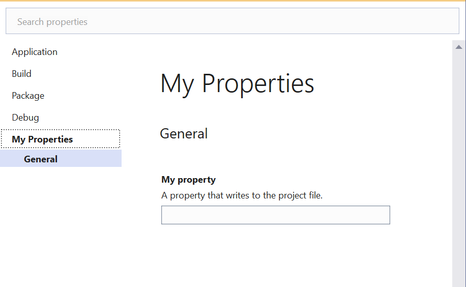

# HOW TO: Add a New Property Page

Property pages are defined by XAML files describing an instance of the [Rule](https://docs.microsoft.com/en-us/dotnet/api/microsoft.build.framework.xamltypes.rule) class. Visual Studio uses these XAML files to dynamically build the UI and bind the controls to properties in your project. This HOW TO describes two options for defining and distributing these XAML files. At the end your property page will look something like this:



## Option 1: XAML file on disk

In this option, the XAML resides in a standalone .xaml file on disk and is included in the end user's project as a specific kind of MSBuild item, `PropertyPageSchema`. Visual Studio reads these items from the project to determine which property pages to show.

This may be an attractive option if you already have a NuGet package or Visual Studio extension that injects MSBuild .props and .targets files into the end user's project, or if you want to use MSBuild `Condition`s to control when the property page is available to a project. 

### Step 1: Define the XAML file

Add a new XAML file named "MyPropertyPage.xaml" to your project. Depending on how the file is created you may end up with a `<Page>` item in your project but this is not what we want as we're not using the file to describe a piece of WPF UI.

Update your project to replace the `<Page>` item with one of the following:

- SDK-style projects:
  ``` xml
  <None Update="MyPropertyPage.xaml">
    <CopyToOutputDirectory>PreserveNewest</CopyToOutputDirectory>
  </None>
  ```
- Non-SDK-style projects:
  ``` xml
  <None Include="MyPropertyPage.xaml">
    <CopyToOutputDirectory>PreserveNewest</CopyToOutputDirectory>
  </None>
  ```

Now VS won't do anything with this file but copy it to the output directory when you build.

### Step 2 (optional): Add the Microsoft.Build.Framework package

Use the NuGet Package Manager to add the Microsoft.Build.Framework package to your project. This is an optional step, but it will allow the XAML editor to find the [Rule](https://docs.microsoft.com/en-us/dotnet/api/microsoft.build.framework.xamltypes.rule) type (and related types) and provide code completion, tool tips, Go to Definition, and other features while you type.

### Step 3: Describe the property page

Replace the contents of MyPropertyPage.xaml with the following:

```xml
<?xml version="1.0" encoding="utf-8" ?>
<Rule Name="MyPropertyPage"
      Description="A description of my project properties page."
      DisplayName="My Properties"
      PageTemplate="generic"
      Order="500"
      xmlns="http://schemas.microsoft.com/build/2009/properties">

  <Rule.DataSource>
      <DataSource Persistence="ProjectFile"
                  SourceOfDefaultValue="AfterContext"
                  HasConfigurationCondition="False" />
  </Rule.DataSource>

  <StringProperty Name="MyProperty"
                  DisplayName="My property"
                  Description="A property that writes to the project file." />

</Rule>
```

The format of the file is described in detail in [Property Specification](property-specification.md), but the most important points are:
- The `Name` must be unique.
- The `PageTemplate` attribute must have the value `"generic"`.

You should now be able to build and see the MyPropertyPage.xaml copied as-is to the output directory.

### Step 4: Define the `PropertyPageSchema` item

Next you need to update your .props or .targets files to properly reference the property page so Visual Studio can find it. Note that the creation and distribution of the .props and .targets files (as well as the distribution of MyPropertyPage.xaml itself) is beyond the scope of this document.

Add the following item to your .props or .targets file:

``` xml
<PropertyPageSchema Include="path\to\MyPropertyPage.xaml">
  <Context>Project</Context>
</PropertyPageSchema>
```

And you're done. Projects that import the .targets file will now show this page when editing the project properties.

## Option 2: Embedded XAML file

In this option the XAML file is embedded in an assembly as a resource and discovered by means of a MEF export. Compared to Option 1 this requires more initial setup but does not require you to distribute an additional file. This may be an attractive option if you are already exporting MEF components for use in Visual Studio.

_Steps to be determined._
