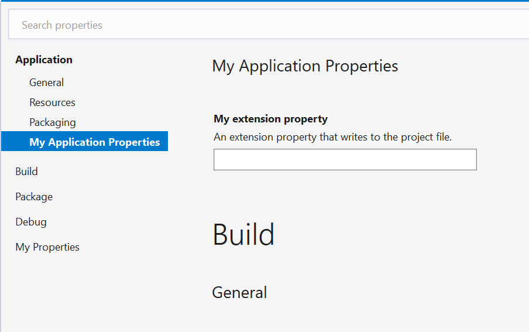

# HOW TO: Extend an Existing Property Page

It is possible to extend an existing property page (even one you do not control) to add new properties. This is useful in scenarios where you have a project-specific property that logically belongs on one of the standard property pages (Application, Build, etc.), or if multiple project types share some common properties but also have their own specific needs.

Extensions are defined using the same XAML files (describing an instance of the [Rule](https://docs.microsoft.com/dotnet/api/microsoft.build.framework.xamltypes.rule) class) that are used to create new property pages. This HOW TO describes the steps needed for adding a property to the "Application" property page. At the end your property page will look something like this:



This process is very similar to [defining a new property page](how-to-add-a-new-project-property-page.md).

### Step 1 (optional): Add the Microsoft.Build.Framework package

Use the NuGet Package Manager to add the Microsoft.Build.Framework package to your project. This is an optional step, but it will allow the XAML editor to find the [Rule](https://docs.microsoft.com/en-us/dotnet/api/microsoft.build.framework.xamltypes.rule) type (and related types) and provide code completion, tool tips, Go to Definition, and other features while you type.

### Step 2: Define the XAML file

Add a new XAML file named "MyExtendedApplicationPage.xaml" to your project. Depending on how the file is created you may end up with a `<Page>` item in your project but this is not what we want as we're not using the file to describe a piece of WPF UI.

Update your project to replace the `<Page>` item with one of the following:

- SDK-style projects:
  ``` xml
  <None Update="MyExtendedApplicationPage.xaml">
    <CopyToOutputDirectory>PreserveNewest</CopyToOutputDirectory>
  </None>
  ```
- Non-SDK-style projects:
  ``` xml
  <None Include="MyExtendedApplicationPage.xaml">
    <CopyToOutputDirectory>PreserveNewest</CopyToOutputDirectory>
  </None>
  ```

Now VS won't do anything with this file but copy it to the output directory when you build.

### Step 3: Define the `PropertyPageSchema` item

Next you need to update the .props or .targets files imported by the end users' projects to properly reference the property page so Visual Studio can find it. Note that the creation and distribution of the .props and .targets files (as well as the distribution of MyExtendedApplicationPage.xaml itself) is beyond the scope of this document.

Add the following item to your .props or .targets file:

``` xml
<PropertyPageSchema Include="path\to\MyExtendedApplicationPage.xaml">
  <Context>Project</Context>
</PropertyPageSchema>
```

Note that order of `PropertyPageSchema` items is important, as that is the order in which extensions are applied. For this reason, the `PropertyPageSchema` item for extension page must come _after_ the item for the base page in the MSBuild evaluation.

### Step 4: Describe the property page

Replace the contents of MyExtendedApplicationPage.xaml with the following:

```xml
<?xml version="1.0" encoding="utf-8" ?>
<Rule Name="Application"
      OverrideMode="Extend"
      xmlns="http://schemas.microsoft.com/build/2009/properties">

    <StringProperty Name="MyExtensionProperty"
                  DisplayName="My extension property"
                  Description="An extension property that writes to the project file." />
</Rule>
```

The format of the file is described in detail in [Property Specification](property-specification.md), but the most important points are:
- The `Name` attribute must match the name of the page you are extending.
- The `OverrideMode` attribute must have the value "Extend", otherwise the base page will be replaced entirely instead of extended.
- None of the other attributes on `Rule` are required, but any present will replace the original attribute on the base page.
- When a property has the same name as a property on the base page, it will replace that property completely. Otherwise, it will be treated as a new property.
- The same applies to categories.

You should now be able to build and see the MyExtendedApplicationPage.xaml copied as-is to the output directory.

And you're done. Projects that import the .targets file will now show this page when editing the project properties.

## Option 2: Embedded XAML file

In this option the XAML file is embedded in an assembly as a resource and discovered by means of a MEF export. Compared to Option 1 this requires more initial setup but does not require you to distribute an additional file. This may be an attractive option if you are already exporting MEF components for use in Visual Studio.

_Steps to be determined._
